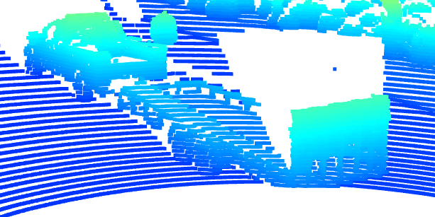
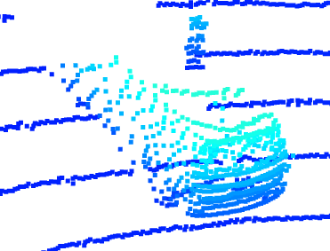
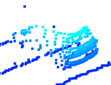
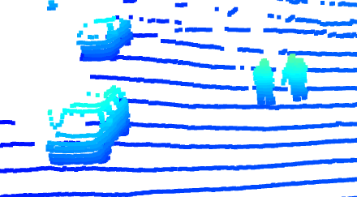
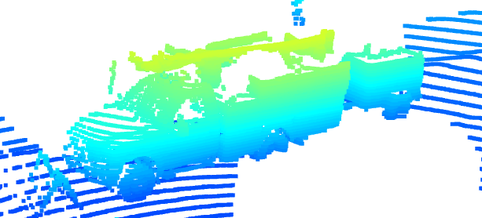

1. Find and display 10 examples of vehicles with varying degrees of visibility in the point-cloud

Large vehicles up close with trailers show up well, however, they end up causing quite a bit of obstruction.  

Normal vehicles also have plenty of detail up close.  

But even far away, the rear bumper and flat areas show up well.  

As can be seen here as well.  

Far away, incoming vehicles are also visible from the front bumper and headlights.  

Vehicles close up and to the rear have great detail. Though it is important to note that the windows don't show up well.  

Pedestrians, likely in reflective clothing, can even be detected with lidar.  

Far away, all that is often visible is the rear bumper and flat areas of the trunk.  

Trucks that have equipment on them often have that equipment show up in the lidar image.  

Cars from the side are often visible quite far away, as the sides are flat.  

2. Identify vehicle features that appear as a stable feature on most vehicles (e.g. rear-bumper, tail-lights) and describe them briefly. Also, use the range image viewer from the last example to underpin your findings using the lidar intensity channel.

As somewhat given above, rear bumpers, front bumpers, flat sides, tail lights, and plates are often visible and stable from quite far away, as are reflective trailers.  

Pedestrians are often visible in high intensity if they are wearing reflective clothing. Front vehicles have their front headlights visible and stable.  

